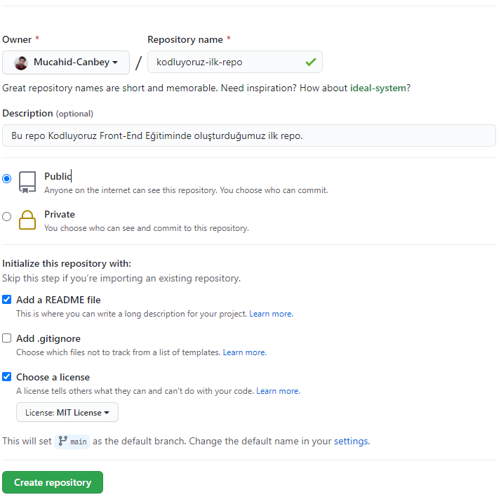

# Git İlk Repo
Bu repo [Kodluyoruz](https://www.kodluyoruz.org/) Front-End Eğitiminde oluşturduğumuz ilk repo. İçerisinde bir adet README dosyası, bir adet de index.html barındırıyor. 

## 

---



## Installation

 proje clon:

```
https://github.com/Mucahid-Canbey/git-ilk-repo.git
```

---

## Usage

Projeyi cloneladıktan sonra Visual Studio Code programında açınız.

Linux için:

```
cd kodluyoruzilkrepo
code .
```

----

## Contributing

Pull requestler kabul edilir. Büyük değişiklikler için, lütfen önce neyi değiştirmek istediğinizi tartışmak için bir konu açınız.

---

## License

[MIT](https://choosealicense.com/licenses/mit/)

